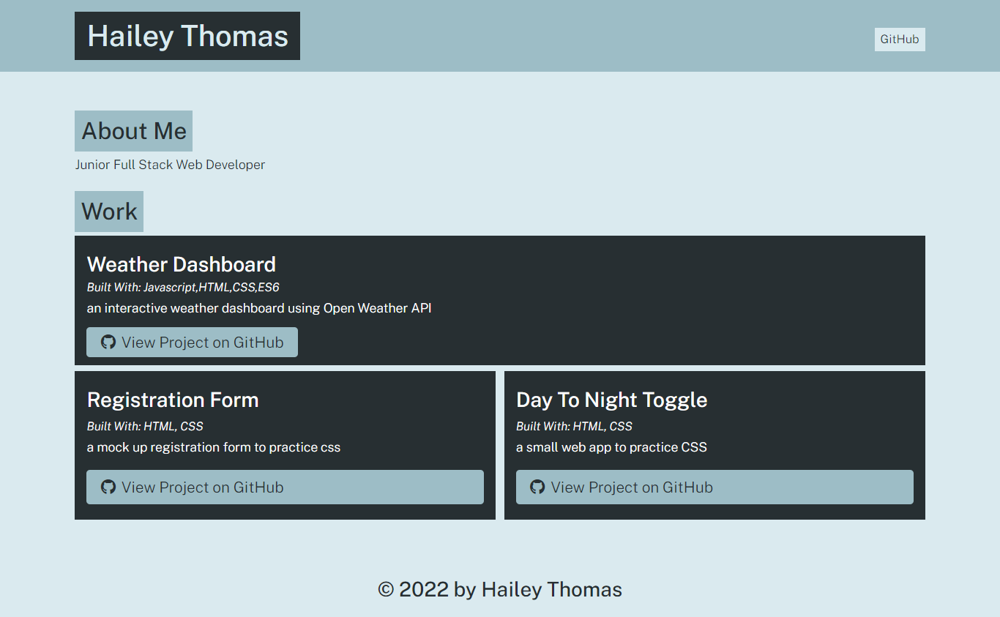

# Portfolio Generator

## Description

Node.js application that runs on your computers terminal and generates a developers portfolio for the user.

## Table of Contents

- [Installation](#installation)
- [Usage](#usage)
- [Credits](#credits)
- [License](#license)

## Installation

Download files from GitHub and run program in your terminal by typing "node index"

## Usage

To use, download files from GitHub and run the application through your terminal. Answer the prompts that appear on the screen and then find your new webpage in the dist folder!

### Screenshot

### Links

- [GitHub](https://github.com/HaileyThomas/portfolio-generator) - link to GitHub project

## Credits

ASU Coding Bootcamp

## License

[License](https://opensource.org/licenses/MIT) - link to license

MIT License

Copyright (c) [2022] [Hailey Thomas]

Permission is hereby granted, free of charge, to any person obtaining a copy
of this software and associated documentation files (the "Software"), to deal
in the Software without restriction, including without limitation the rights
to use, copy, modify, merge, publish, distribute, sublicense, and/or sell
copies of the Software, and to permit persons to whom the Software is
furnished to do so, subject to the following conditions:

The above copyright notice and this permission notice shall be included in all
copies or substantial portions of the Software.

THE SOFTWARE IS PROVIDED "AS IS", WITHOUT WARRANTY OF ANY KIND, EXPRESS OR
IMPLIED, INCLUDING BUT NOT LIMITED TO THE WARRANTIES OF MERCHANTABILITY,
FITNESS FOR A PARTICULAR PURPOSE AND NONINFRINGEMENT. IN NO EVENT SHALL THE
AUTHORS OR COPYRIGHT HOLDERS BE LIABLE FOR ANY CLAIM, DAMAGES OR OTHER
LIABILITY, WHETHER IN AN ACTION OF CONTRACT, TORT OR OTHERWISE, ARISING FROM,
OUT OF OR IN CONNECTION WITH THE SOFTWARE OR THE USE OR OTHER DEALINGS IN THE
SOFTWARE.

## Tests

No testing at this time.

## Questions

If you have any questions please contact me below.

### Contact

- [Email](mailto:haileyraebeauty@gmail.com) - Email Hailey Thomas : haileyraebeauty@gmail.com
- [GitHub](https://github.com/HaileyThomas) - GitHub username : HaileyThomas
